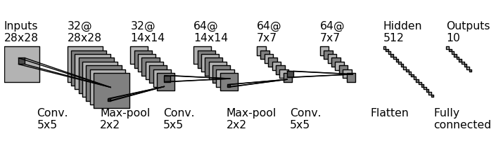
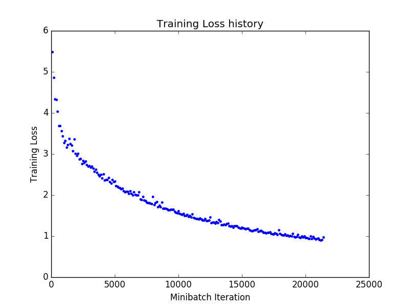
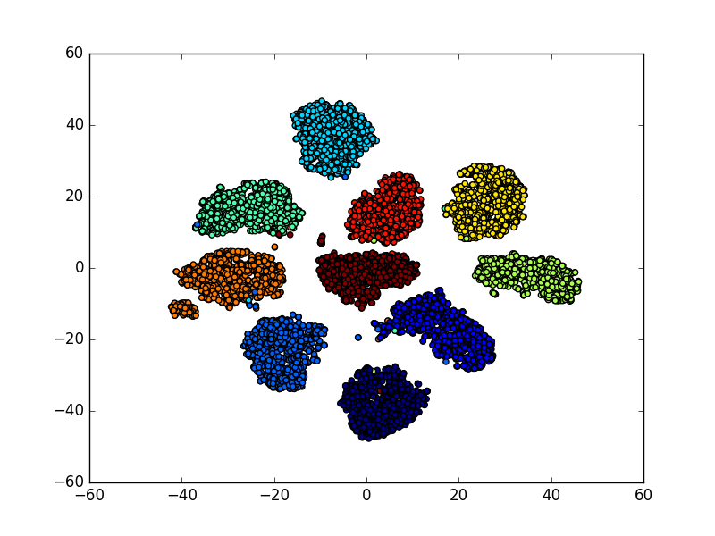

# TensorFlow101

I have recently been playing around with [TensorFlow](https://www.tensorflow.org/) after being introduced to it during [cs224d](http://cs224d.stanford.edu/) at Stanford last quarter. 

TensorFlow code hosted on Github includes some great tutorials and example models to help beginners get started, including an LeNet-5 like Convolutional Neural Network model to recognize handwritten digits. The original model code in available [here](https://github.com/tensorflow/tensorflow/blob/master/tensorflow/models/image/mnist/convolutional.py). 

Here I have attempted to rewrite and extend this CNN model:

* Keep track of the best model parameters, and save this model to disk at the end of the training step
* Qualitatively evaluate learned features using [t-Distributed Stochastic Neighbor Embedding](https://lvdmaaten.github.io/tsne/)
* Make the code more modular - steps for adding training variables, constructing the model, adding the loss operation and training operation, creating the feed dictionary etc are now separated into different functions. Hopefully this is helpful in making the computational graph construction and execution more transparent and easy to understand.

## 6-layer CNN Architecture

Constructed this figure using [Gavin Ding's](https://github.com/gwding/draw_convnet) Python script to illustrate CNN architectures, which is really neat and you should check it out! I modified this script slightly, and have included the modified script in this repo. 

## Training Loss history

Nothing much to say here

## t-SNE Embedding
t-SNE is a technique for dimensionality reduction. Using t-SNE to visualize a clustering of the input data is a common technique to qualitatively evaluate how good the learned features are. In this case, features are extracted from the output of the first hidden layer, which means each input image is transformed into a 512 dimensional feature vector. 

Here I have used a particular implementation of this technique which uses the Barnes-Hut approximation. For a more detailed explanation (and many more cool examples) see [Laurens van der Maaten's tsne website](https://lvdmaaten.github.io/tsne/). In the figure below, points with a particular color all belong to the same label
(i.e. they are the same digit).

## Performance
On the MNIST test dataset, this model achieves a **0.5%** test error. 

## Requirements
* In order to run model training and evaluation, you need  to download and install TensorFlow (see OS-specific instructions [here](https://www.tensorflow.org/versions/r0.9/get_started/os_setup.html)).
* In order to run the t-SNE visualization, you need the tsne and matplotlib Python modules. All these requirements are in the `requirements.txt` file.

## Hardware
I trained my models on a AWS g2.2xlarge GPU instance, using a community AMI with TensorFlow pre-installed (ami-d8433cb8). For details about configuring the AWS instance, see this [tutorial](https://cs224d.stanford.edu/supplementary/aws-tutorial-2.pdf).

## Run it

To train a new model: 
`python mnist.py -train`

To extract features using a trained model: 
`python mnist.py -features`

To generate a t-SNE visualization: 
`python plot_tsne.py`